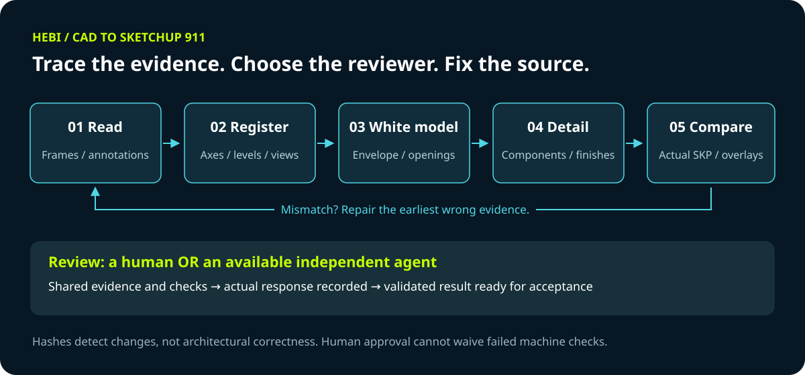
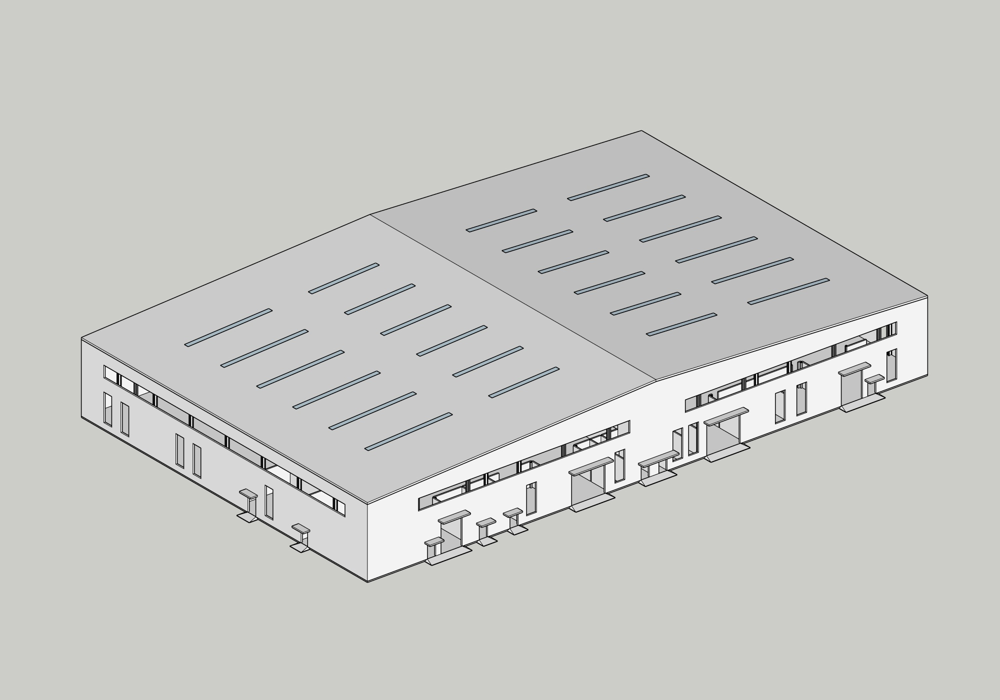
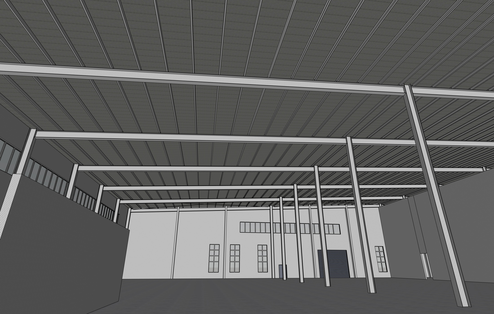
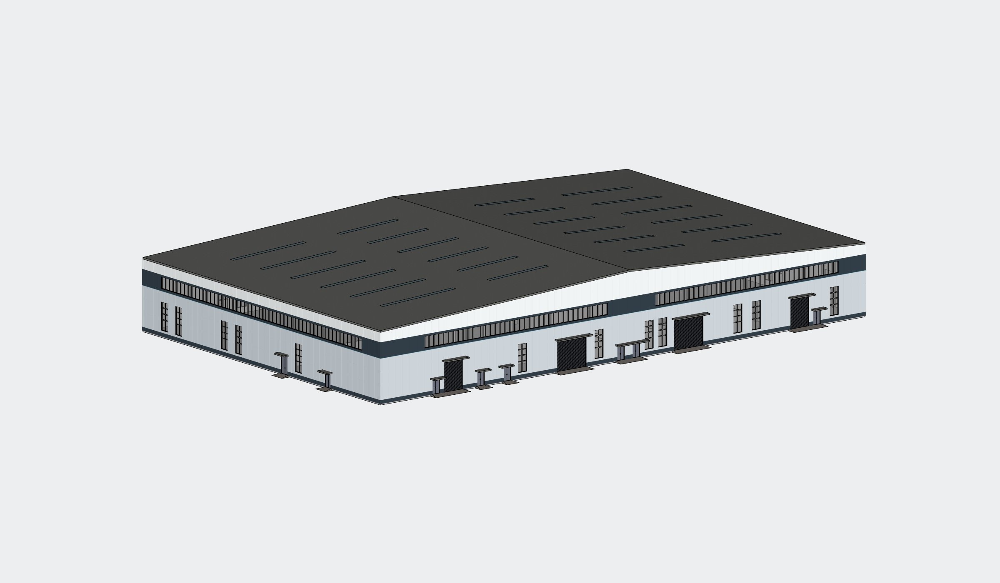

  

<h1 align="center">何必 HEBI · CAD to SketchUp 911</h1>

<strong>让建筑图纸成为模型的依据，让每一步都有迹可查。</strong>

Windows · SketchUp · 人工 / 可选 Agent 审核

> **待审阅草稿 · 尚未公开发布**
> 本仓库用于作者审阅。911 版已完成脚本回归与打包检查，但尚未完成新版真实建模实测。

## 这是什么？

一套把建筑 CAD 平面、立面和剖面转化为 SketchUp 模型的 Skill。
它不是独立建模软件，也不是“给任意图纸就自动交付”的黑盒：
由可读写项目文件、执行脚本的主 Agent 调用，在读图、白模、细化和验收之间保留证据。

**一个 Skill，两种审核方式。** 首次使用选择人工审核，或通过已有连接请另一 Agent 审核。
没有额外 Agent 也能使用，不绑定模型、供应商或多 Agent 调度平台。

## 原理：先读懂，再建模，最后对照

1. **读图**：保留完整图框、标注与嵌套块，检查清晰度和内容覆盖。
2. **对齐**：统一轴线、方向与标高，核对平、立、剖之间的对应关系。
3. **白模**：先验证轮廓、楼层、屋顶和门窗洞口，再进入细化。
4. **细化**：为重复构件复用组件定义，补充门窗分格及简单材质。
5. **对照**：把实际模型按同方向、同比例导出，与独立图纸证据比较。

发现错误时回到最早出错的依据或模型约束修正，而不是只把最终模型“补得像”。
文件哈希用于识别证据是否改变，不能代替建筑判断。

## 过程留存

**以下为同一项目在此前开发过程中的真实模型截图，并非 911 版自动生成的新测试。**
室内结构补充和立面设计包含人工确认及项目专用脚本，不能据此承诺通用 Skill 一键复现。

### 01 / 先确定白模与真实洞口

先检查主体轮廓、洞口位置和雨棚、入口等构件，避免装饰细节掩盖基础几何问题。
此时门窗精细构造与材质尚未完成；图中的屋面采光带不能仅凭外观视为已验证的真实穿孔。

### 02 / 组件与室内结构补充

沿既有柱位补充屋顶构件，并对相同构件复用组件。参考图与用户允许的估计只用于
示意建模，构件截面与连接形式未经结构计算，不能作为施工设计依据。

### 03 / 保留洞口的立面设计探索

在既有门窗洞口不变的条件下尝试银白色外包铝板和深色横向分带。
这是用户追加的方案设计任务，不是从 CAD 自动推导出的原始建筑材质。

## 911 版做了哪些取舍？

| 保留 | 精简或改为可选 |
| --- | --- |
| 完整读图、坐标对齐、实际模型对照 | 不绑定特定模型或协调平台 |
| 真实洞口、重复构件组件化、简单材质 | 不携带其他建模软件和下载脚本 |
| 版本保存、证据变化检查、审核回执 | 不打包个人日志、凭证、历史工程 |
| 人工或独立 Agent 的实际反馈 | 不要求用户编辑 JSON 或输入切换命令 |

只复查受修改影响的内容，复用仍然有效的中间成果。普通模型调整不再强制触发 Skill 升级。

## 如何使用？

**环境**：Windows、可运行脚本的主 Agent、Python 依赖，以及支持所需实体运算的 SketchUp。
当前白模墙体合并路径需要 SketchUp Pro 的实体并集能力。
DWG 必须通过可用且获准的转换方式得到匹配 DXF；PDF/图片仅作为辅助证据。

可下载 [911 技能包](dist/cad-to-sketchup-model-2026-09-11.zip)，或使用
[完整 Skill 目录](skills/cad-to-sketchup-model-2026-09-11/)。
包内顶层文件夹即 Skill，安装到主 Agent 支持的 skills 目录，不要只提取 `SKILL.md`。
依赖和具体执行要求见 [技能入口](skills/cad-to-sketchup-model-2026-09-11/SKILL.md)。

安装后可以这样说：

> 用 CAD to SketchUp 911，依据这个文件夹建模。

首次选择审核方式，项目内保留该选择；后续直接说“切换人工审核”或“切换其他 Agent 审核”。
选择其他 Agent 并不自动安装软件或开通账号，需要用户已有可用连接，并验证其读图能力。

人工模式下，用户查看可读的图纸和模型对照后自然语言反馈；主 Agent 负责记录。
读图审核在建模前完成；拓扑审核与批准、最终审核与验收分别合并展示。

## 验证与限制

- 911 打包时通过 **69 项自动测试**，并在独立解压目录重跑通过。
- 另完成命令入口、审核选择、任意 CAD 文件名等 **8 项运行检查**。
- Skill 结构、Python/JSON 解析、文档链接与 PowerShell 语法已检查。
- 以上包含合成测试夹具，不等于真实建筑模型验收，也不证明外部 Agent 的视觉判断可靠。
- 缺少必需图纸证据或校验失败时，只能提供说明限制的候选成果，不能宣称完整验证交付。
- 尚不支持本次承诺范围之外的 Mac 工作流；不提供结构、施工或加工认证。

## 作者审阅项

- [ ] Logo、名称、文案与案例说明合适。
- [ ] 过程图片允许公开，未包含不应公开的项目内容。
- [ ] 下一轮真实 CAD / SketchUp 测试范围已确定。
- [ ] 对外许可方式与正式发布名称已确认。

**在作者明确批准前，保持私有与 Draft，不发布公开 Release，不改变仓库可见性。**
